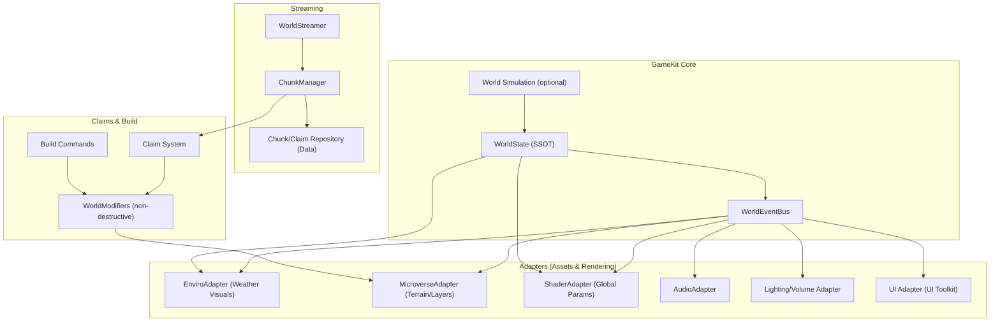
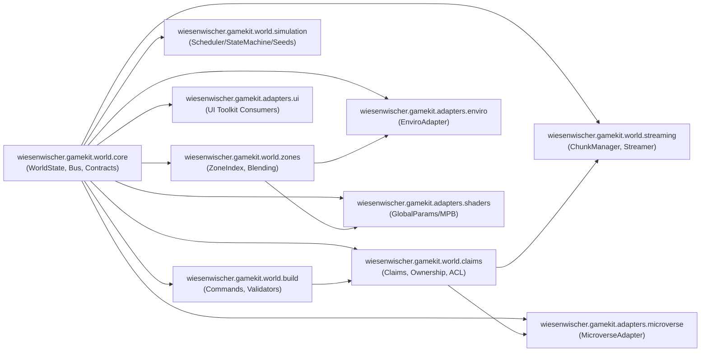
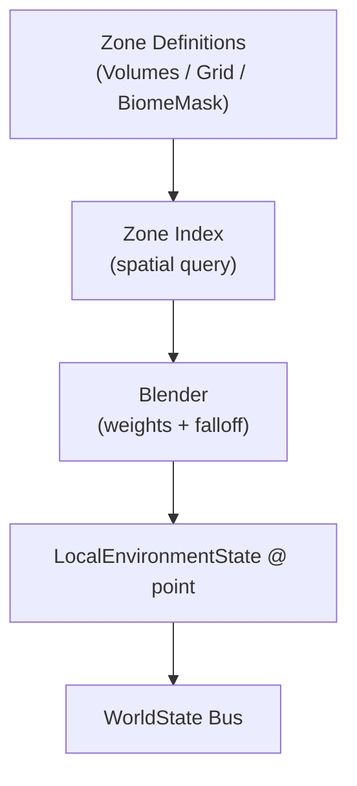
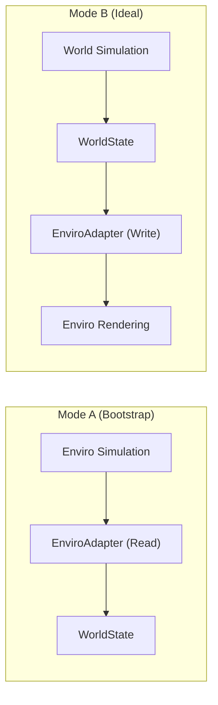
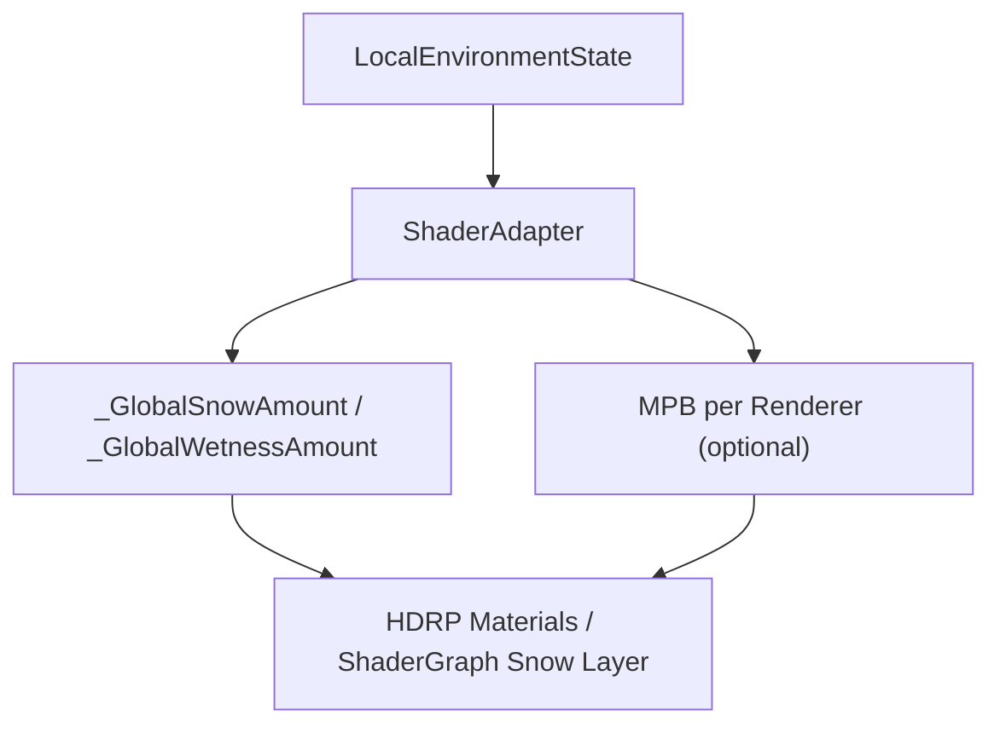
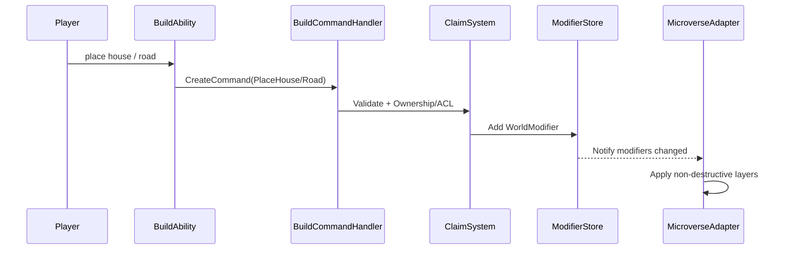
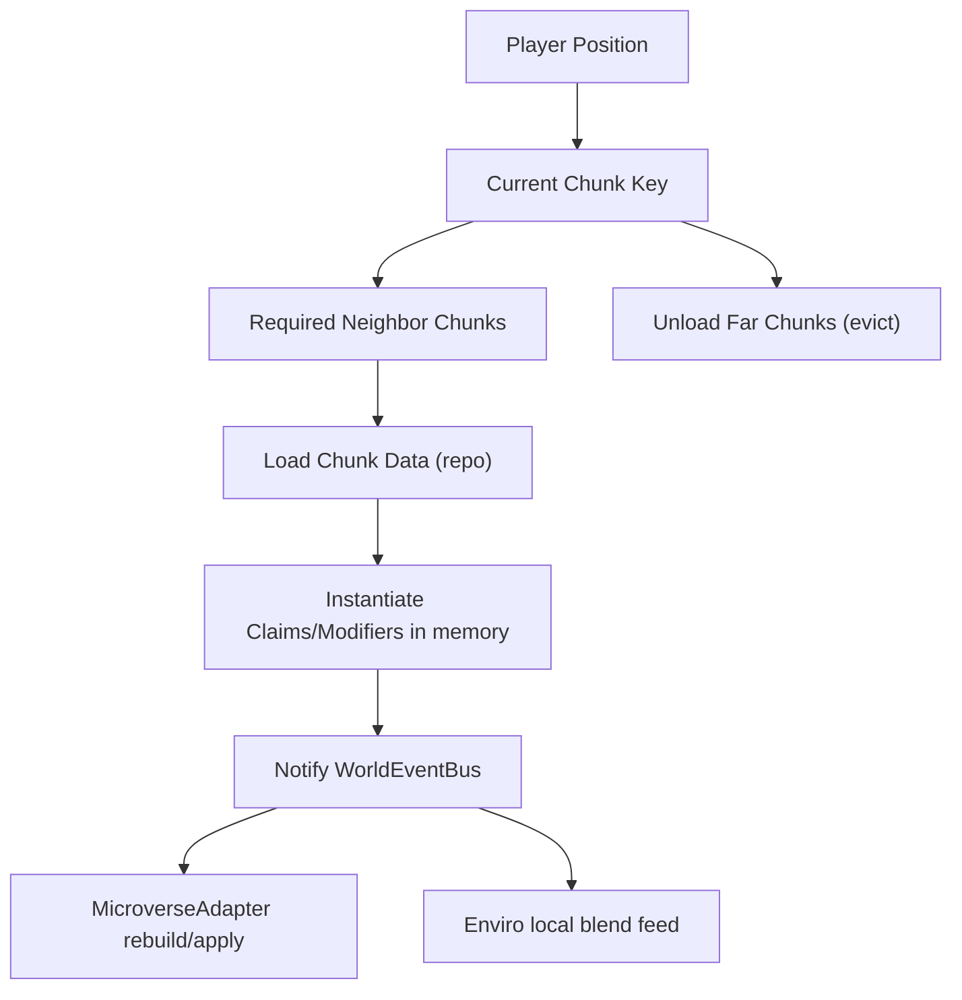

# Wiesenwischer GameKit — AAA World Architecture (Master Doc)

> Ziel: Eine modulare, austauschbare, MMO‑fähige Weltarchitektur für **Terrain (Microverse)**, **Weather (Enviro)**, **Claims/Build**, **Zone‑Environment** und **Chunk‑Streaming** — kompatibel mit **HDRP** und einem **Ability‑driven** GameKit.

---

## 0. Leitplanken

### Golden Rules
1. **WorldState ist die Single Source of Truth (SSOT)** für Gameplay-relevante Umweltzustände.
2. **Assets sind Adapter**, keine Master-Systeme (Enviro/Microverse dürfen nicht “regieren”).
3. **Commands statt Mesh-Sync**: Multiplayer/Streaming basiert auf **Daten & Commands**, nicht auf Terrain-Meshes.
4. **Non‑destructive World**: Terrain/Vegetation/Build wird über **Modifier/Layers** beschrieben.
5. **Schnee/Wetness = Shader Parameter Stream** (global + optional lokal), nicht “pro Material hardcoded”.

---

## 1. System-Landkarte (High Level)



**Interpretation**
- **WorldState + EventBus** sind dein “Kernel”.
- **Build/Claims** erzeugen **Modifiers** (Daten), die Microverse non‑destructive anwendet.
- **Enviro** rendert Wetter, wird aber über deinen **Adapter** gesteuert/ausgelesen.
- **Streaming** lädt/unlädt **Datenpakete** (Chunks/Claims/Modifiers), nicht Unity‑Szenen als Primärquelle.

---

## 2. Package Boundaries (GameKit Pakete & Abhängigkeiten)

> Ziel: Asset‑Store‑fähig, austauschbar, klare Referenzen.



### Dependency Rules (wichtig)
- `world.core` darf **keine** Asset‑Referenzen enthalten.
- Adapter‑Pakete dürfen `world.core` referenzieren, aber nicht umgekehrt.
- `build` kennt **nur** `claims + core contracts`, nicht Microverse/Enviro direkt.
- `streaming` lädt Daten → “pluggt” sie ins Claim/Modifier System.

---

## 3. WorldState Contract (SSOT)

### Empfohlenes Datenmodell
- **Global**: Zeit/Jahreszeit als Baseline
- **Local (am Player/Camera)**: geblendete Zone‑Werte

```csharp
public readonly struct GlobalWorldState
{
    public float TimeOfDay { get; }
    public Season Season { get; }

    // Baseline climate knobs
    public float GlobalTemperatureOffset { get; }
}

public readonly struct ZoneState
{
    public float Rain { get; }       // 0..1
    public float Snow { get; }       // 0..1
    public float Fog { get; }        // 0..1
    public float Wind { get; }       // 0..1
    public float Temperature { get; } // °C (optional)
}

public readonly struct LocalEnvironmentState
{
    public GlobalWorldState Global { get; }
    public ZoneState Local { get; } // already blended at point
}
```

### Eventing
- `WorldStateChanged(GlobalWorldState)`
- `LocalEnvironmentChanged(LocalEnvironmentState)`
- `ClaimChanged(ClaimId)` / `ModifierAdded(...)`

---

## 4. Zone System (Skyrim/Zelda‑Style)

### Ziel
- Unterschiedliches Wetter parallel
- Smooth Übergänge durch Blending



### Praktische Entscheidung
- **Start**: Grid/Chunks (robust, MMO‑freundlich)
- **Später**: BiomeMask‑basierte Zonen (Microverse), wenn Biomes “Quelle der Wahrheit” sein sollen

### Blending-Formel (vereinfachtes Schema)
- `weight = smoothstep(0..1, distanceToBoundary / falloff)`
- normieren der Gewichte
- lineares Blending der Parameter (`Rain`, `Snow`, `Fog`, `Wind`, `Temp`)

---

## 5. Enviro Integration: Simulation vs Rendering

### Unterstützte Modi
**A) Enviro als Simulation-Quelle (schnell startklar)**
- Enviro berechnet Weather → Adapter liest Werte → WorldState wird befüllt
- Gameplay liest nur WorldState (nicht Enviro)

**B) World Simulation als Quelle (langfristig ideal)**
- dein Scheduler/StateMachine bestimmt Zielprofile/Transitions
- Adapter steuert Enviro Rendering (und optional “blind” ohne Enviro Simulation)



### Empfehlung für dich
- **Kurzfristig**: Mode A, um schnell Resultate zu sehen.
- **Mittelfristig**: Mode B, wenn Multiplayer/Determinismus wichtig wird.

---

## 6. Schnee/Wetness in HDRP (Props, Häuser, Straßen)

### Ziel
- Schneedecke auf Roofs/Props
- Wetness auf Roads/Stone/Metal
- Asset‑unabhängige Steuerung

### Mechanik
- **Global Shader Params** (für “Weltzustand”)
- optional **MaterialPropertyBlock** für lokale/claim‑spezifische Overrides



**Pragmatik**
- Wenn Enviro Uber Shader in HDRP “funktioniert”, ist es ok als **Bootstrap**.
- Langfristig: **HDRP ShaderGraph Snow Layer** (Top‑Quality + volle Kontrolle).

---

## 7. Build System (Ability‑driven → Commands → Modifiers)

### Grundsatz
- Build erzeugt **Commands**
- Commands erzeugen **WorldModifiers**
- Modifiers sind die einzige “persistente Wahrheit”



### Modifier-Typen (Beispiele)
- `RoadSplineModifier`
- `FlattenStampModifier`
- `TextureOverrideModifier`
- `VegetationClearModifier`
- `FoundationPlacementModifier`
- `PropSpawnModifier`

---

## 8. Claim System (Ownership, Rechte, Persistenz)

### Struktur
- Claim ist ein Bereich + Owner + Policy + Modifiers

```csharp
public sealed class Claim
{
    public ClaimId Id { get; }
    public Bounds Area { get; }
    public ClaimOwner Owner { get; }
    public ClaimPolicy Policy { get; } // roles/permissions
    public IReadOnlyList<WorldModifier> Modifiers { get; }
}
```

### Warum “Modifiers only”
- Buildings/Roads/Terraform sind nur Darstellungen von Modifier‑Daten
- macht Undo/Replay/Sync möglich

---

## 9. Chunk Streaming (datenbasiert, nicht nur Scene Streaming)

### Was wir streamen
- Claim Definitions
- Modifiers
- optional: spawnable props as data (oder deterministisch aus Seeds)



### Minimal Streaming Algorithm
- Chunk Size z.B. 256m/512m
- Active radius z.B. 2–3 Chunks
- bei Chunkwechsel: Load Neighbors, Unload außerhalb Radius

### Hinweis zu Assets
- Viele Streaming Assets sind **Scene-centric**.
- Für dich zählt **Modifier/Claim-aware Streaming** → das ist meist “custom glue”, auch wenn du Addressables/Scene-Loader nutzt.

---

## 10. Interest Management (vorgemerkt / später)

> Wir haben festgehalten, dass wir es brauchen — Umsetzung später.

**Warum**: Für MMO skaliert “Distance-based streaming” irgendwann nicht (Server/Netzwerk).  
Interest Management ist die nächste Stufe (Relevanz nach Sicht, Party, Ownership, Combat, etc.).

---

## 11. Implementation Checklist (Pragmatisch)

### Phase 1 — Bootstrap (schnell sichtbar)
- Enviro installieren, HDRP korrekt konfigurieren (nur ein Sky-System aktiv)
- Mode A: Enviro Simulation → WorldState Adapter (read)
- ShaderAdapter: `_GlobalSnowAmount`, `_GlobalWetnessAmount`
- Microverse: Basis Terrain + ein Road/Flatten Workflow
- Claim + Modifier Store minimal
- Chunk Streaming minimal (load/unload Claims/Modifiers)

### Phase 2 — Production Hardening
- Zone System + Blending (Grid)
- Build Validators (slope, collision, claim policy)
- Deterministische Seeds für Wetter/vegetation spawns
- Save/Load (Claims + Modifiers) robust

### Phase 3 — MMO Ready
- Server authoritative: Commands/Modifiers
- Interest Management
- World Simulation (Mode B), Enviro nur Rendering

---

## 12. Recommended Repo Files
- `docs/architecture/ARCH_world_master.md` (dieses Dokument)
- `docs/architecture/ARCH_world_state.md`
- `docs/architecture/ARCH_claims_build.md`
- `docs/architecture/ARCH_streaming.md`
- `docs/architecture/ARCH_weather_enviro.md`
- `docs/architecture/ARCH_shaders_snow_wetness.md`
